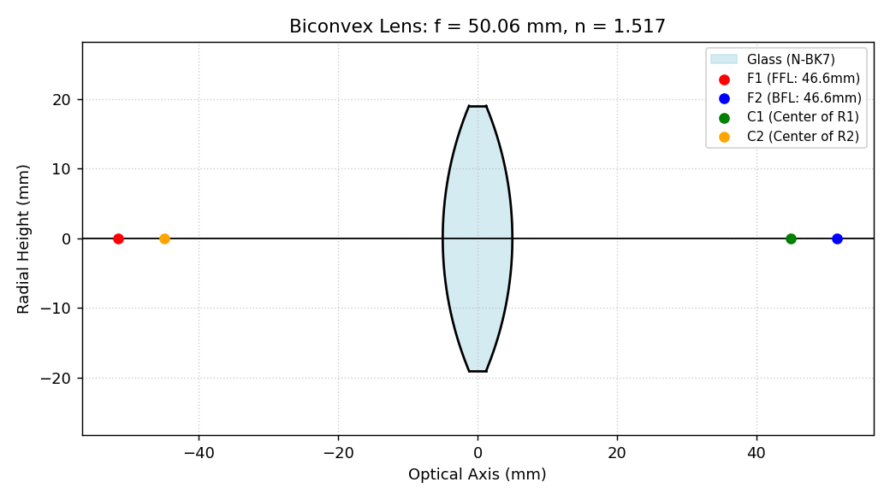

# Lens Geometry & Manufacturability Simulator

An interactive Tkinter tool that draws a lens cross-section from its prescription
(radii, thickness, index, diameter), computes its focal length and focal points,
and flags whether the geometry is physically manufacturable.



## What it does

Enter the lens parameters and the tool:

1. **Classifies the lens** from the signs of R1 and R2 — biconvex, biconcave,
   plano-convex, or plano-concave.
2. **Draws the true cross-section** (spherical surfaces + edges) filled as glass,
   with the centres of curvature (C1, C2) and front/back focal points (F1, F2)
   marked on the optical axis.
3. **Computes the focal length** from the thick-lens lensmaker's equation, and
   the front/back focal lengths (FFL / BFL) from the principal-plane positions.
4. **Checks manufacturability** and prints a warning when the geometry is
   invalid:
   - *Sag / edge-thickness error* — the surface sag exceeds the centre
     thickness, so the lens would have zero or negative edge thickness.
   - *Hemisphere limit exceeded* — the clear aperture is larger than the surface
     can physically support (diameter > 2·|R|).

## Physics

Thick-lens power (lensmaker's equation):

```
1/f = (n − 1) · [ 1/R1 − 1/R2 + (n − 1)·T / (n·R1·R2) ]
```

Front and back focal lengths are measured from the lens vertices using the
principal-plane offsets, so the plotted F1/F2 are the real focal points, not a
thin-lens approximation. Default glass is N-BK7 (n ≈ 1.517).

**Sign convention:** R1 > 0 for a surface whose centre of curvature is to the
right; R2 < 0 for a biconvex lens. Set a radius to 0 for a flat (plano) surface.

## Run

```bash
pip install numpy matplotlib
python lens_siumulator_app.py
```

Enter R1, R2, thickness, refractive index, and diameter (default diameter is
1.5″ = 38.1 mm), then click **Draw Lens**. Requires Tkinter (bundled with
standard Python; on some Linux distros install `python3-tk`).

## Example

Defaults (R1 = 50, R2 = −50, T = 10 mm, n = 1.517, ⌀ = 38.1 mm) give a biconvex
lens with **f ≈ 50.1 mm** and FFL = BFL ≈ 46.6 mm, as shown above.
