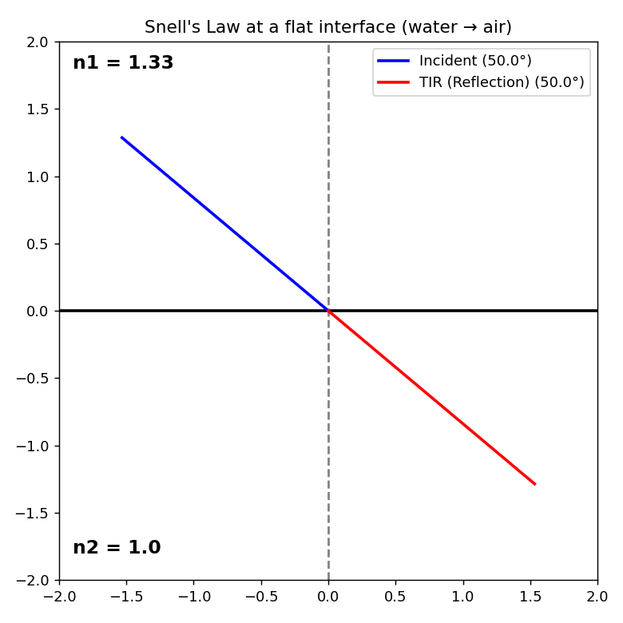

# Snell's Law — Flat Interface (Interactive)

An interactive Matplotlib tool that visualizes refraction at a flat interface
between two media. Enter the incidence angle and the two refractive indices and
the ray diagram updates live, correctly handling **refraction**, the
**critical angle**, and **total internal reflection (TIR)**.



## Physics

Snell's law relates the incidence and refraction angles across an interface:

```
n1 · sin(θ_i) = n2 · sin(θ_r)
```

The tool classifies three regimes:

- **Refraction** — the ray crosses into the second medium at `θ_r`.
- **Critical angle** — `sin(θ_r) ≈ 1`; the refracted ray grazes the interface.
- **Total internal reflection** — `n1·sin(θ_i)/n2 > 1`; the ray reflects instead
  of transmitting (shown via the law of reflection).

## Run

```bash
pip install matplotlib
python snells_law_UI.py
```

Type values into the **n1**, **n2**, and **Angle (i)** boxes and press Enter to
redraw. Defaults model a water→air interface (n1 = 1.33, n2 = 1.0, θ_i = 50°),
which is past the critical angle and shows TIR.
