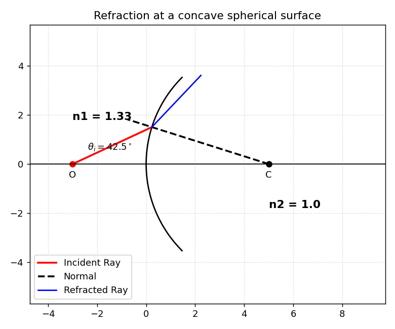

# Snell's Law — Curved Surfaces (Interactive)

A Tkinter GUI that traces a ray refracting at a **spherical optical surface**
(concave or convex). Set the radius, object position, both refractive indices,
and the incidence angle, then plot the incident ray, the surface normal through
the centre of curvature, and the refracted ray.



## Physics

At a spherical surface the local surface normal passes through the centre of
curvature **C**, so the incidence angle is measured between the ray and that
radial normal — not a fixed axis. The tool:

1. Finds where the incident ray intersects the spherical arc.
2. Builds the normal from the hit point to **C**.
3. Applies Snell's law about that normal, `n1·sin(θ_i) = n2·sin(θ_r)`.
4. Draws the refracted ray, flagging **total internal reflection** when the
   refraction angle has no real solution.

Concave and convex surfaces are handled separately (arc orientation and the
sign of the centre offset differ).

## Run

```bash
pip install numpy matplotlib
python snells_law_curved_surface.py
```

Choose **Concave** or **Convex**, adjust the inputs in the sidebar, and click
**Calculate & Plot**. Requires Tkinter (bundled with standard Python; on some
Linux distros install `python3-tk`).
