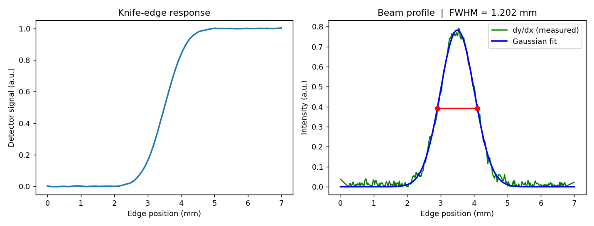

# Knife-Edge Beam Profiler

Measure the width of a focused laser or THz beam from a **knife-edge scan** — a
standard, wavelength-agnostic optical metrology technique. Give it a scan of
detector signal versus edge position and it returns the beam **FWHM** and
**1/e² diameter** by differentiating the edge response and fitting a Gaussian.



## How it works

In a knife-edge measurement a sharp edge is translated across a focused beam
while a detector records the transmitted power at each step. For a Gaussian
beam the recorded edge response is an **error-function (sigmoid)** curve. Its
spatial derivative recovers the beam's **intensity profile**, which is Gaussian;
the Full Width at Half Maximum (FWHM) of that Gaussian is the beam diameter at
the scan plane.

```
edge scan  ──d/dx──▶  Gaussian profile  ──fit──▶  FWHM ─▶ beam diameter
```

The pipeline:

1. **Load** an edge scan (your CSV, or a built-in synthetic scan).
2. **(Optional) Smooth** with a Savitzky–Golay filter — differentiation
   amplifies noise, so smoothing before `d/dx` matters for noisy data.
3. **Differentiate** to obtain the beam intensity profile.
4. **Fit a Gaussian** and report the FWHM analytically
   (`FWHM = 2·√(2·ln2)·σ`) plus the 1/e² diameter (`D = 4σ`).

The method is wavelength-independent — it works for visible, IR, or THz beams.

## Installation

```bash
git clone https://github.com/<your-handle>/knife-edge-beam-profiler.git
cd knife-edge-beam-profiler
pip install -r requirements.txt
```

## Usage

Run the built-in synthetic demo (no data needed):

```bash
python knife_edge_beam_profiler.py --smooth
```

Analyze your own scan — a two-column CSV `position_mm,signal`:

```bash
python knife_edge_beam_profiler.py --csv examples/sample_scan.csv --smooth
```

Run headless and save the figure instead of showing it:

```bash
python knife_edge_beam_profiler.py --smooth --save examples/example_output.png
```

Example console output:

```
Beam FWHM        : 1.2018 mm
1/e^2 diameter   : 2.0414 mm
Fitted centre    : 3.5004 mm
Fitted sigma     : 0.5104 mm
```

### Options

| Flag | Default | Description |
|------|---------|-------------|
| `--csv PATH` | — | Two-column CSV (`position_mm, signal`). If omitted, a synthetic scan is used. |
| `--distance` | `7.0` | Synthetic scan length (mm). |
| `--beam-fwhm` | `1.2` | True beam FWHM for the synthetic scan (mm). |
| `--noise` | `0.004` | Synthetic noise level. |
| `--smooth` | off | Apply Savitzky–Golay smoothing before differentiation. |
| `--save PATH` | — | Save the figure to a file (headless) instead of showing it. |

## Input format

A plain CSV with a header row and two columns:

```csv
position_mm,signal
0.000000,0.001432
0.020057,-0.002881
...
```

See [`examples/sample_scan.csv`](examples/sample_scan.csv).

## Notes

- Differentiation amplifies high-frequency noise; use `--smooth` (and keep the
  Savitzky–Golay window as small as still gives a clean derivative) for real
  measurements.
- The reported **FWHM** is the beam diameter at half-maximum intensity; the
  **1/e² diameter** (`4σ`) is the convention most laser datasheets use.
- The synthetic generator produces an ideal Gaussian-beam edge so you can verify
  the recovered width against the ground truth you set with `--beam-fwhm`.

## License

MIT — see [LICENSE](LICENSE).
